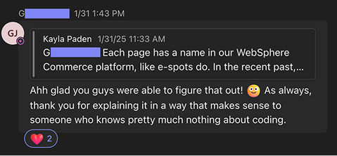

<header>
    
</header>

 

<h1 align="center">Hello, World! 🌎</h1>
    

        I'm Kayla, a software developer from the United States. 
        I bring my background in music 🹠and language 💬 to the world of coding. 
        And yes, I really do juggle. 🤹
    

 

<h2 align="center">The Stack 💻</h2>

   

   

  

 

 

  

 

<h2 align="center"> Current Projects 🔥</h2>

    <table align="center">
        <thead>
            <tr>
                <th>Project</th>
                <th>Stars</th>
                <th>Forks</th>
                <th>Issues</th>
                <th>Pull Requests</th>
                <th>Last Commit</th>
            </tr>
        </thead>
        <tbody>
            <tr>
                <td>
                    <a href="https://github.com/Open-SGF/gooddads">Good Dads</a>
                </td>
                <td>
                    
                </td>
                <td>
                    
                </td>
                <td>
                    
                </td>
                <td>
                    
                </td>
                <td>
                    
                </td>
            </tr>
        </tbody>
    </table>

 

<h2 align="center"> Other Projects & Technical Work 🚀</h2>
A lot of my work is done outside of GitHub using various platforms such as WordPress and WebSphere Commerce.  The table below highlights some of those projects as well as some of my favorite Git commits.

| Project | Description | Tech Stack |
|--------|-------------|------------|
| **[Ascend Adventure Packs](https://www.basspro.com/b/ascend-adventure-packs)** | Collaborated with digital merchants and designers to build a new type of product page for the Bass Pro website which includes dynamic modal sliders to demonstrate product features | HTML, CSS, JavaScript, Splide JS |
| **[Shop the Look](https://www.basspro.com/b/shop-the-look)** | Collaborated with third party Syndeca, designer, and merchant to implement shoppable images as a grid on the Bass Pro Shops website | HTML, CSS, Vanilla JavaScript |
| **[Springfield Meetup API](https://github.com/Open-SGF/sgf-meetup-api)** | [Prototyped initial GraphQL API query](https://github.com/Open-SGF/sgf-meetup-api/pull/7/files) to retrieve local meetup data while learning GraphQL for the first time | GraphQL, AWS |
| **[Hack4Good](https://github.com/ZackBradshaw/GoodDads)** | Developed a proof of concept single-page LMS application with an admin desktop view and participant mobile view; won 2nd place at hack-a-thon | Angular, Google Forms, Firebase |
| **[Good Dads](https://github.com/Open-SGF/gooddads)** | Pick up of winning Hack4Good project; contribute weekly to this open source project for a local non-profit, learning a new tech stack (featured above in Current Projects) | Laravel, Inertia, React |
| **[Etch-A-Sketch](https://jugglingdev.github.io/etch-a-sketch/)** | Built this fully self-structured project for fun, [documenting my learnings](https://github.com/jugglingdev/etch-a-sketch) and adding new features based on designer feedback (be sure to visit the gallery!) | Vanilla JS, HTML/CSS |
| **[This Supplement Sucks](https://thissupplementsucks.com/)** | Developing this freelance Wordpress site with custom CSS designs and SEO-first content strategy | WordPress, CSS |
| **Vizteams [Frontend](https://github.com/codelabs-springfield-vizient-group-2024/vizteams-fe) and [Rails API](https://github.com/codelabs-springfield-vizient-group-2024/vizteams-api)** | Collaborated on this full stack capstone project to simplify team management; merged pull requests include [handling profile pictures](https://github.com/codelabs-springfield-vizient-group-2024/vizteams-api/pull/13) | Angular, Angular Material, Ruby on Rails |

 

<h2 align="center"> Awards 🏆</h2>

🔗 **[Excellence in Technology Award – Rising Star](https://sgftechcouncil.com/news/excellence-in-technology-award-winners-2024)**
Recognized in September 2024 for excellence as an up-and-coming local professional who has been working in technology for less than five years.

🔗 **[Hack4Good – 2nd Place](https://github.com/ZackBradshaw/GoodDads)**
Awarded 2nd place in the 2023 hack-a-thon for the team's solution of a learning management system using Google Forms API, Chart.js, Firebase Auth and Gmail, and OneSignal for push notifications.

 

<h2 align="center">Online Courses and Certifications 🎓</h2>

<h3>General</h3>

    🌼 Learning How to Learn

<h3>Software Development</h3>

    🌼 Interneting Is Hard - HTML & CSS Is Hard
    🔸 The Odin Project - Foundations 🏫
    🌼 Codefi CodeLabs - Full-Stack Web Development
    🔸 CSS for JavaScript Developers 🏫
    🔸 The Joy of React 🏫

<h3>Data</h3>

    🌼 DataCamp - Understanding Data Topics (Data Science, Data Engineering, Data Visualization, Cloud Computing, and Machine Learning)
    🌼 DataCamp - Introduction to Power BI
    🌼 DataCamp - Introduction to SQL, Intermediate SQL, and Intermediate SQL Queries

 

<h2 align="center"> Bookshelf 📚</h2>

<h3>Programming</h3>

    🌼 Hackers and Painters
    🌼 Clean Code
    🌼 The Self-Taught Programmer
    🌼 Teach Yourself Java in 21 Days
    🔸 The Pragmatic Programmer 📖

<h3>Strategy & Culture</h3>

    🌼 Good to Great
    🌼 Measure What Matters
    🌼 Willpower Doesn't Work
    🌼 Building a Storybrand
    🌼 It Doesn't Have to Be Crazy at Work

 

<h2 align="center"> More Wins 💪🏻</h2>

Many mentors and leaders recommend documenting wins, so here are some more I've gathered when collaborating with others.

**General**

**Documentation**

**Communication**

 

<footer>
    <h2 align="center"> Find Me 🔍</h2>
    

        
        
    

 
    
👋 <em>Thanks for visiting!</em>

</footer>
